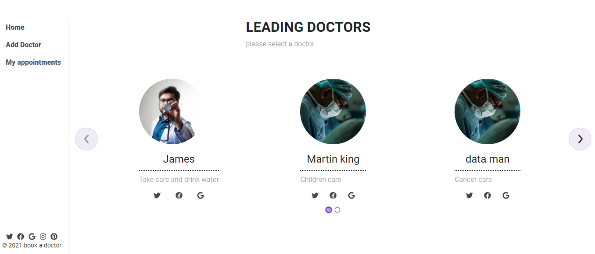

<<<<<<< HEAD

## 🤝 Contributing

Contributions, issues, and feature requests are welcome!

Feel free to check the [issues page](https://github.com/Mhdez221993/spacex-travelers-hub/issues)

=======

## Show your support

Give a ⭐️ if you like this project!

=======

## Acknowledgments

- Microverse for giving me this chance
- To my Stand Up Team and coding partners who kept my morale up!
- The amazing code reviewers for making me improve every day.
=======

# Doctors Booking App
This is a Doctors online platform for booking appointments.

* Doctors
The Docors section displays a list of all available Doctors. Users can book a doctor by clicking the reservation button or cancel the previously made booking.

* Appointments
The Appointments section displays a list of current appointments along with their brief description. 

My Profile
The My Profile section displays all reserved doctors and booked appointments.





## Kanban board


## Built With
- JavaScriptgit branch -a
- Ruby on Rails
- React
- Redux
- Webpack
- HTML/SCSS
- Node.JS
- Jest
- Rspec


## Getting Started

```cmd
git clone  git@github.com:Mhdez221993/spacex-travelers-hub.git
cd bookstore
npm install
npm start
```

## Available Scripts


In the project directory, you can run:


### `Rails s`

Launches the app.

### `npm run build`


**Note: this is a one-way operation. Once you `eject`, you can’t go back!**

If you aren’t satisfied with the build tool and configuration choices, you can `eject` at any time. This command will remove the single build dependency from your project.


### `npm run build` fails to minify

This section has moved here: [https://facebook.github.io/create-react-app/docs/troubleshooting#npm-run-build-fails-to-minify](https://facebook.github.io/create-react-app/docs/troubleshooting#npm-run-build-fails-to-minify)

================

### Verify linters

```cmd
npx eslint .
npx stylelint "**/*.{css,scss}"
```
- Autofix linters errors

```cmd
npx eslint . --fix
npx stylelint "**/*.{css,scss}" --fix
```

- you can install it locally

```cmd
npm install --save-dev eslint@7.11.x eslint-config-airbnb@18.1.x eslint-plugin-import@2.22.x eslint-plugin-jsx-a11y@6.2.x eslint-plugin-react@7.20.x eslint-plugin-react-hooks@2.5.x babel-eslint@10.1.x

npm install --save-dev stylelint@13.3.x stylelint-scss@3.17.x stylelint-config-standard@20.0.x stylelint-csstree-validator
```

## Authors

👤 **Donat UWAMAHORO**

- GitHub: [@Donat UWAMAHORO](https://github.com/uwadonat)
- Twitter: [@Donat UWAMAHORO](https://twitter.com/uwahoroDonat)
- LinkedIn: [Donat UWAMAHORO](https://www.linkedin.com/in/uwadonat/)


👤 **Elisha Kyakopo**

- Linkedin: [Elisha Kyakopo](https://www.linkedin.com/in/elisha-kyakopo/)
  
- Github: [@elisha2kyakpo1](https://github.com/elisha2kyakpo1)
- Twitter: [@elisha1k](https://twitter.com/Elisha1k)


👤 **Erez Friemagor**


- GitHub: [@Erez Friemagor](https://github.com/erezfree29)
- Twitter: [@Erez Friemagor](https://twitter.com/friemagor)
- LinkedIn: [Erez Friemagor](https://www.linkedin.com/in/tendai-nyandoro/)


👤 **Tendai Nyandoro**

- GitHub: [@Tendai Nyandoro](https://github.com/tnyandoro)
- Twitter: [@tendainyandoro](https://twitter.com/tendainyandoro)
- LinkedIn: [Tendai Nyandoro](https://www.linkedin.com/in/tendai-nyandoro/)

=======

## 🤝 Contributing

Contributions, issues, and feature requests are welcome!

Feel free to check the [issues page](https://github.com/Mhdez221993/spacex-travelers-hub/issues)

=======

## Show your support

Give a ⭐️ if you like this project!

=======

## Acknowledgments
- Microverse for giving me this chance
- To my Stand Up Team and coding partners who kept my morale up!
- The amazing code reviewers for making me improve every day :thumbsup:
=======


# Doctors Booking App

This is a Doctors online platform for booking appointments.

- Menu
  The Docors section displays a list of all available Doctors. Users can book a doctor by clicking the reservation button.

- My appointments
  The Appointments section displays a list of current appointments along with their brief description.


## Live Demo

[LIVE LINK](https://damp-brook-57775.herokuapp.com/)

## Built With

- JavaScriptgit
- Ruby on Rails
- React
- Redux
- Webpack
- HTML/SCSS
- Node.JS
- Jest
- Rspec

## Getting Started

```cmd
git clone https://github.com/elisha2kyakpo1/Book-an-Appointment.git
cd Book-an-Appointment
bundle i
npm install
```

## Available Scripts

In the project directory, you can run:

### `Rails s`

Open your browser, and run the command below

```
localhost:3000
```

================

### Verify linters

```cmd
npx eslint .
npx stylelint "**/*.{css,scss}"
```

- Autofix linters errors

```cmd
npx eslint . --fix
npx stylelint "**/*.{css,scss}" --fix
```

- you can install it locally

```cmd
npm install --save-dev eslint@7.11.x eslint-config-airbnb@18.1.x eslint-plugin-import@2.22.x eslint-plugin-jsx-a11y@6.2.x eslint-plugin-react@7.20.x eslint-plugin-react-hooks@2.5.x babel-eslint@10.1.x

npm install --save-dev stylelint@13.3.x stylelint-scss@3.17.x stylelint-config-standard@20.0.x stylelint-csstree-validator
```

### Run test

```cmd
bundle exec rspec ./spec/models
```

## Authors

👤 **Donat UWAMAHORO**

- GitHub: [@Donat UWAMAHORO](https://github.com/uwadonat)
- Twitter: [@Donat UWAMAHORO](https://twitter.com/uwahoroDonat)
- LinkedIn: [Donat UWAMAHORO](https://www.linkedin.com/in/uwadonat/)

👤 **Elisha Kyakopo**

- Linkedin: [Elisha Kyakopo](https://www.linkedin.com/in/elisha-kyakopo/)
- Github: [@elisha2kyakpo1](https://github.com/elisha2kyakpo1)
- Twitter: [@elisha1k](https://twitter.com/Elisha1k)

👤 **Erez Friemagor**

- GitHub: [@Erez Friemagor](https://github.com/erezfree29)
- Twitter: [@Erez Friemagor](https://twitter.com/friemagor)
- LinkedIn: [Erez Friemagor](https://www.linkedin.com/in/tendai-nyandoro/)

👤 **Tendai Nyandoro**

- GitHub: [@Tendai Nyandoro](https://github.com/tnyandoro)
- Twitter: [@tendainyandoro](https://twitter.com/tendainyandoro)
- LinkedIn: [Tendai Nyandoro](https://www.linkedin.com/in/tendai-nyandoro/)

=======

## 🤝 Contributing

Contributions, issues, and feature requests are welcome!

Feel free to check the [issues page](https://github.com/Mhdez221993/spacex-travelers-hub/issues)

=======

## Show your support

Give a ⭐️ if you like this project!

=======

## Acknowledgments

- Microverse for giving me this chance
- To my Stand Up Team and coding partners who kept my morale up!
- The amazing code reviewers for making me improve every day.
>>>>>>> 7f8c539de00891d35e2983c3ded5d00d30ad6d5b
